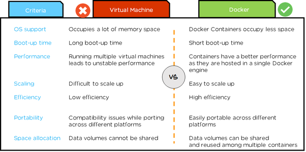

<h2> What is Docker? </h2>

Docker is an open platform that is used for running applications and packaging them into containers. It seperates applications from the infrastructure to deliver software quickly. Applications can run in a isolated environmentm (containers) these are leightweight and contain everything needed to run an app so you do not need to rely on what is currently installed on the host.

<h2> Why use Docker vs VM </h2>

**Docker** containers are isolated and dont require hardware hpyervisor. Therefore containers are much smaller and require less resources than  a VM. It is also a lot faster and the containers can be shared across teams saving time and eliminating `works on my machine` errors.

**VMs** tools are easier to access and simpler to work with whereas Docker has a more complicated ecosystem that conists of docker-managed and third-party tools.

**Paypal uses Docker** to drive a "cost efficiency and enterprise-grade-security" for its infrastructure. Docker has helped reduce the numbers of VMs it needs to run.

**Application development**: Docker is primarily used to package an application’s code and its dependencies. The same container can be shared from Dev to QA and later to IT, thus bringing portability to the development pipeline.

**Running microservices applications**: Docker lets you run each microservice that makes up an application in its own container. In this way, it enables a distributed architecture.

Docker vs VM uses : [Source](https://www.aquasec.com/cloud-native-academy/docker-container/docker-containers-vs-virtual-machines/)

<h2> Benefits of Docker </h2>

  

<h2> Who is using Docker? </h2>

**Other major companies that deploy Docker include:**

- Business Insider
- Spotify, Yelp
- ADP
- eBay
- Expedia
- Groupon
- ING
- New Relic
- The New York Times
- Oxford University Press
- PayPal
- Sage
- Shopify
- The Washington Post
- Uber

<h2> what is Micro-services architecture <h2>

<h2> Micro-services architecture vs Monolith and use cases </h2>

<h2> is Micro-services architecture always useful? </h2>

Commands

`docker run -d  -p 4000:4000 docs/docker.github.io`

`docker exec -it 541a12610cbe sh`

` docker ps -a` see containers status

`docker images` see images

`docker rmi <name> -f` forcefully remove a container

**How to transfer files from localhost to container or vise versa**
- Get file directory from localhost
- Get container ID
- Get the path on container you want to export the file to
- `docker cp <src-path> <container>:<dest-path> `
- `docker cp index 273a24b429cd:/usr/share/nginx/html`
- `docker commit 273a24b429cd mueed/eng89_mueed_docker_task:tagname` docker commit <container> <repo:tag>